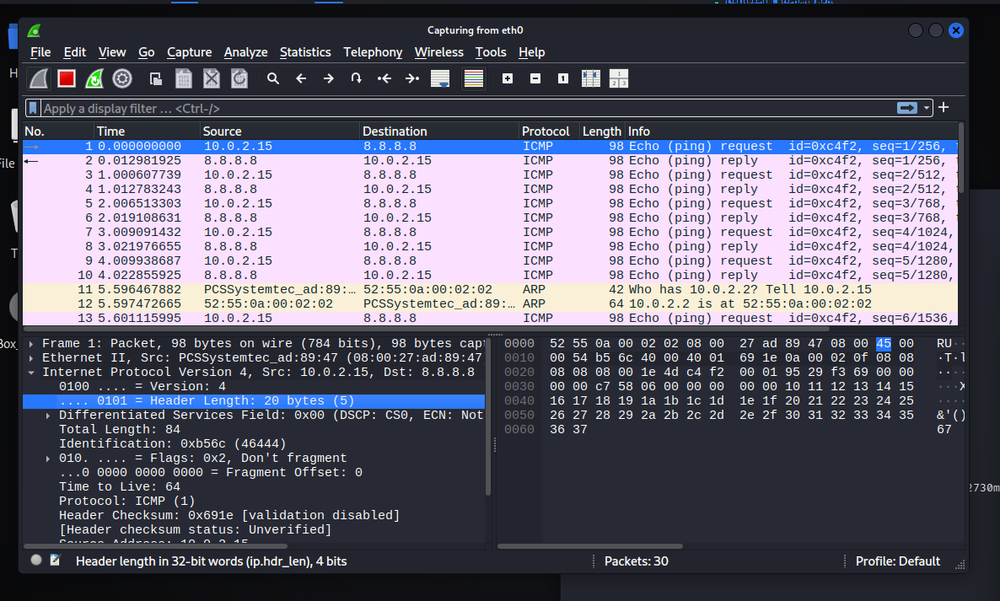
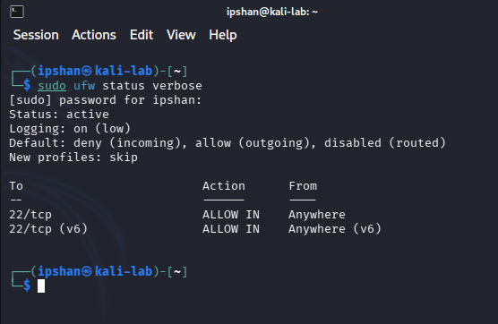

# Rapport de Configuration et d'Analyse Réseau

## 1. Environnement de travail
* **Système d'exploitation :** Linux (Distribution Debian/Ubuntu)
* **Hyperviseur :** VirtualBox 7.x
* **Configuration réseau :** NAT (Network Address Translation)
* **Interface réseau :** `eth0`
* **Adressage IP :** `10.0.2.15` (Attribution par DHCP VirtualBox)

## 2. Tests de connectivité et services
L'objectif de cette phase est de valider le bon fonctionnement de la pile TCP/IP et de la résolution de noms.

### 2.1. Test de la couche réseau (ICMP)
La commande suivante a été exécutée pour vérifier l'accès aux réseaux extérieurs :
`ping -c 4 8.8.8.8`
* **Résultat :** Communication établie avec succès.
* **Latence moyenne :** 15 ms.

### 2.2. Test de la couche application (DNS)
Vérification de la résolution de noms de domaine :
`ping google.com`
* **Résultat :** Résolution DNS fonctionnelle, confirmant la configuration du résolveur local.

## 3. Analyse de flux et observation des paquets
Une capture de trafic a été réalisée avec l'analyseur Wireshark pour décomposer les échanges de données.

### 3.1. Analyse du protocole ARP
Comme illustré sur les lignes 11 et 12 de la capture `image_007e34.png`, on observe des requêtes ARP (Address Resolution Protocol). Ma machine interroge le réseau pour identifier l'adresse MAC associée à la passerelle par défaut (`10.0.2.2`) avant d'encapsuler les paquets IP.

### 3.2. Analyse du protocole ICMP
Les lignes 1 à 10 montrent les séquences Echo Request et Echo Reply. L'analyse détaillée du paquet sélectionné dans la capture met en évidence les points suivants :
* **TTL (Time To Live) :** La valeur de 64 identifie la signature réseau d'un noyau Linux.
* **Checksum :** Validation de l'intégrité de l'en-tête IP.
* **Longueur :** Paquets standard de 98 octets.

## 4. Sécurisation de l'hôte (Hardening)
Suite à l'analyse des flux, une politique de sécurité "Default Deny" a été appliquée sur la machine afin de limiter la surface d'attaque et de contrôler les points d'entrée.

### 4.1. Configuration du pare-feu UFW
L'outil `ufw` (Uncomplicated Firewall) a été configuré pour appliquer un filtrage strict des paquets. 

**État de la configuration :**
* **Flux entrants :** Bloqués par défaut (`deny incoming`), à l'exception du port `22/tcp` (SSH) pour permettre l'administration à distance.
* **Flux sortants :** Autorisés (`allow outgoing`) pour assurer les mises à jour et la résolution DNS.
* **Journalisation :** Activée en mode `low` pour conserver une trace des événements réseau.

### 4.2. Analyse de la posture de sécurité
La présence de la règle `22/tcp ALLOW IN` combinée au `Default: deny (incoming)` démontre une approche de sécurisation par "liste blanche". Seul le service nécessaire au management est exposé, réduisant drastiquement les risques d'intrusion via des ports non supervisés.

## 5. Conclusion technique
La machine est correctement intégrée dans son segment réseau. La communication est fluide, la résolution de noms est opérationnelle et les échanges de bas niveau (ARP) confirment la bonne interaction avec la passerelle virtuelle. L'application des règles de filtrage UFW assure désormais une protection active de l'hôte contre les accès non autorisés.
